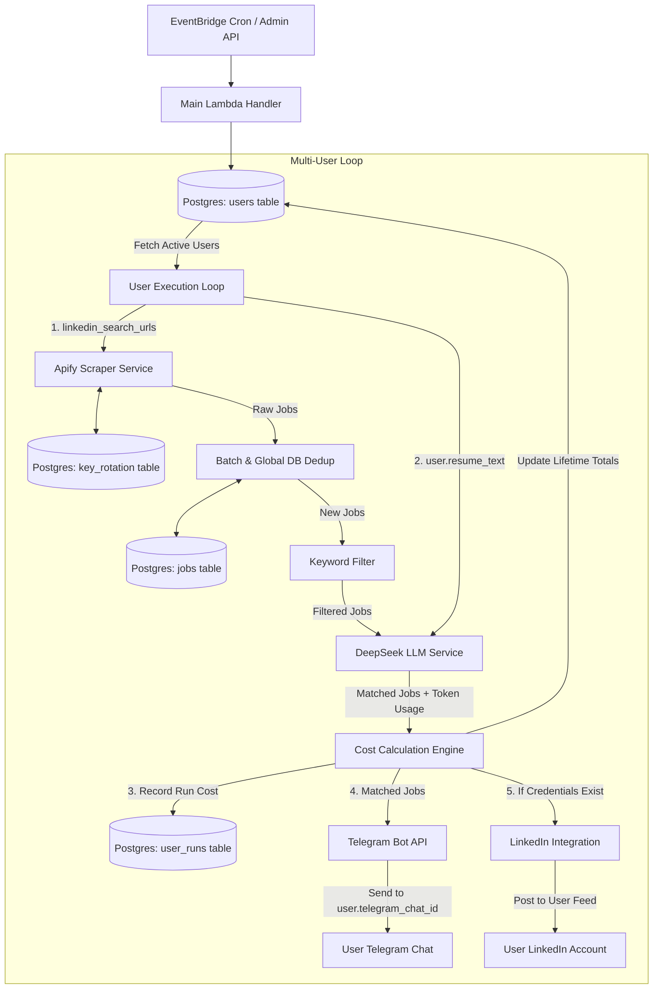

# Multi-User Architecture & Per-Run Cost Tracking System Design

## Goal Description
Transform the existing single-user `apify-jobs-fetcher` application into a multi-tenant system. 

Key objectives:
1. **Multi-User Management**: Store per-user configurations in a `users` table including LinkedIn target search URLs, Telegram chat ID, LinkedIn credentials, and full resume text string (eliminating static file dependence).
2. **Per-Run Cost Tracking & Auditing**: Implement a hybrid cost tracking architecture with a dedicated `user_runs` ledger table for granular historical run costs (LLM tokens + Apify scrape fees) and aggregated lifetime cost metrics on the `users` table.
3. **Multi-Tenant Execution Engine**: Update the main Lambda loop to iterate through active users, execute personalized scraping/matching against each user's resume, calculate per-run execution costs, push notifications to the user's Telegram chat, and optionally trigger LinkedIn integration if credentials exist.
4. **Shared Resource Pool**: Maintain the single `key_rotation` table as a shared pool for Apify API key rotation across all users.

---

## Architecture Overview



---

## 1. Database Schema Design (Drizzle ORM)

### `src/db/schema.ts` Changes

```typescript
import { pgTable, text, timestamp, serial, doublePrecision, date, integer, boolean, jsonb } from "drizzle-orm/pg-core";

// 1. Global Jobs Deduplication Ledger (Unchanged)
export const jobs = pgTable("jobs", {
  jobLink: text("job_link").primaryKey(),
  fingerprint: text("fingerprint").unique(),
  seenAt: timestamp("seen_at", { withTimezone: true }).defaultNow(),
});

// 2. Shared Key Rotation Pool for Apify (Unchanged)
export const keyRotation = pgTable("key_rotation", {
  id: serial("id").primaryKey(),
  apiKey: text("api_key").notNull().unique(),
  usageCost: doublePrecision("usage_cost").default(0),
  name: text("name"),
  subscriptionStartDate: date("subscription_start_date").notNull(),
  updatedAt: timestamp("updated_at", { withTimezone: true }).defaultNow(),
});

// 3. Multi-Tenant Users Table [NEW]
export const users = pgTable("users", {
  id: serial("id").primaryKey(),
  email: text("email").notNull().unique(),
  name: text("name"),
  resumeText: text("resume_text").notNull(), // User's resume text string
  telegramChatId: text("telegram_chat_id").notNull(), // Target Telegram Chat ID
  telegramBotToken: text("telegram_bot_token"), // Optional custom bot token (falls back to ENV)
  linkedinCredentials: jsonb("linkedin_credentials").$type<{
    accessToken?: string;
    refreshToken?: string;
    personUrn?: string;
  }>(), // Optional user LinkedIn OAuth details
  isActive: boolean("is_active").default(true).notNull(),
  totalLlmCostUsd: doublePrecision("total_llm_cost_usd").default(0).notNull(), // Cumulative LLM cost
  totalRunsCount: integer("total_runs_count").default(0).notNull(), // Cumulative run count
  lastRunAt: timestamp("last_run_at", { withTimezone: true }),
  createdAt: timestamp("created_at", { withTimezone: true }).defaultNow().notNull(),
  updatedAt: timestamp("updated_at", { withTimezone: true }).defaultNow().notNull(),
});

// 4. Per-Run Execution & Cost Audit Ledger [NEW]
export const userRuns = pgTable("user_runs", {
  id: serial("id").primaryKey(),
  userId: integer("user_id").references(() => users.id, { onDelete: "cascade" }).notNull(),
  runAt: timestamp("run_at", { withTimezone: true }).defaultNow().notNull(),
  status: text("status").notNull(), // 'SUCCESS' | 'PARTIAL_FAILURE' | 'FAILED'
  
  // Job Metrics
  scrapedJobsCount: integer("scraped_jobs_count").default(0).notNull(),
  newJobsCount: integer("new_jobs_count").default(0).notNull(),
  matchedJobsCount: integer("matched_jobs_count").default(0).notNull(),
  rejectedJobsCount: integer("rejected_jobs_count").default(0).notNull(),
  
  // DeepSeek Token Metrics
  llmPromptCacheHitTokens: integer("llm_prompt_cache_hit_tokens").default(0).notNull(),
  llmPromptCacheMissTokens: integer("llm_prompt_cache_miss_tokens").default(0).notNull(),
  llmCompletionTokens: integer("llm_completion_tokens").default(0).notNull(),
  
  // Cost Metrics (USD)
  llmCostUsd: doublePrecision("llm_cost_usd").default(0).notNull(),
  apifyCostUsd: doublePrecision("apify_cost_usd").default(0).notNull(),
  totalRunCostUsd: doublePrecision("total_run_cost_usd").default(0).notNull(),
  
  errorMessage: text("error_message"),
});
```

---

## 2. Cost Tracking & Calculation Design

### Dual-Layer Cost Strategy

> [!IMPORTANT]
> **Why both `user_runs` and `users` tables are necessary:**
> 1. **`user_runs` Table**: Solves the problem of historical tracking, cost rate analysis, and run auditability. It captures exact token usage (`cache_hit`, `cache_miss`, `completion`), Apify scraping cost, and job counts for every execution.
> 2. **`users` Table (`total_llm_cost_usd`, `total_runs_count`)**: Stores instant lifetime aggregations updated atomically at run completion, preventing expensive `SUM()` scans across millions of historical runs when rendering dashboards or checking billing limits.

### Cost Calculation Formulas

```typescript
// DeepSeek Pricing Model (Per 1,000,000 tokens in USD)
const PRICE_CACHE_HIT = 0.014;
const PRICE_CACHE_MISS = 0.14;
const PRICE_COMPLETION = 0.28;

// Apify Scraper Pricing Model (Per job scraped in USD)
const PRICE_PER_SCRAPED_JOB = 0.001;

export function calculateRunCost(
  usage: TokenUsage,
  scrapedJobsCount: number
): { llmCostUsd: number; apifyCostUsd: number; totalRunCostUsd: number } {
  const llmCostUsd = Number((
    (usage.promptCacheHitTokens / 1_000_000) * PRICE_CACHE_HIT +
    (usage.promptCacheMissTokens / 1_000_000) * PRICE_CACHE_MISS +
    (usage.completionTokens / 1_000_000) * PRICE_COMPLETION
  ).toFixed(6));

  const apifyCostUsd = Number((scrapedJobsCount * PRICE_PER_SCRAPED_JOB).toFixed(6));
  const totalRunCostUsd = Number((llmCostUsd + apifyCostUsd).toFixed(6));

  return { llmCostUsd, apifyCostUsd, totalRunCostUsd };
}
```

---

## 3. Dynamic DeepSeek Prompt Construction

Currently, `deepseek.ts` imports a static `resume.txt` file at build time. We will modify `checkRelevanceBatch` to accept `resumeText` dynamically per user run:

```typescript
export function buildSystemPrompt(resumeText: string): string {
  return `You are a strict job-fit evaluator. Your only job is to determine if a job posting is worth applying to for this specific candidate.

## CANDIDATE RESUME
${resumeText}

---
## EVALUATION CRITERIA... (Rules, Scoring Guide, Few-Shot Examples)`;
}
```

> [!TIP]
> DeepSeek automatic context caching applies to any repeated system prompt prefix $\ge 1024$ tokens. Since each user's `resumeText` stays constant between their daily runs, DeepSeek will hit the prompt cache ($0.014 / 1M tokens) on subsequent batches for that user!

---

## 4. Lambda Execution Flow

1. **Initialization**: Main Lambda starts and resets any expired Apify tokens (`resetHighUsageTokens()`).
2. **Fetch Active Users**: Query `users` table for all rows where `isActive = true`.
3. **Iterate Users**:
   - Prepare LinkedIn search URLs for current user.
   - Execute Apify scraping (rotating keys via `key_rotation`).
   - Deduplicate batch internally & check against global `jobs` table (preventing duplicate processing across users/runs).
   - Pass user's `resumeText` + un-seen jobs to DeepSeek.
   - Calculate `llmCostUsd`, `apifyCostUsd`, and `totalRunCostUsd`.
   - **Persist Run Ledger**: Insert row into `user_runs`.
   - **Update User Record**: Increment `totalLlmCostUsd` and `totalRunsCount` on `users` table.
   - **Persist Jobs**: Insert new seen jobs into `jobs` table.
   - **Notify Telegram**: Send matched jobs and run cost summary to `user.telegramChatId` (using `user.telegramBotToken` or default env token).
   - **LinkedIn Sync**: If `user.linkedinCredentials` are present, enqueue matched jobs for user's LinkedIn profile.

---

## Proposed Changes & File Modifications

### `src/db/schema.ts`
- Add `users` table definition.
- Add `user_runs` table definition.

### `src/helper/db_helper.ts`
- Add `getActiveUsers()` to fetch active users from DB.
- Add `recordUserRun(runData)` to log per-run metrics & costs into `user_runs`.
- Add `updateUserCostTotals(userId, llmCost, apifyCost)` to atomically increment lifetime metrics.

### `src/helper/deepseek.ts`
- Refactor `checkRelevanceBatch` to accept `resumeText: string` dynamically instead of using static build-time `resume.txt`.

### `src/lambda.ts`
- Update main handler loop to iterate over active users from `users` table instead of relying on environment variables (`TELEGRAM_MATCHED_JOBS_CHAT_ID`) and static search URLs.

---

## Verification & Testing Plan

### Automated Verification
1. **TypeScript Typecheck**:
   ```bash
   npm run typecheck
   ```
2. **Drizzle Migration Check**:
   ```bash
   npm run db:generate
   ```

### Manual Verification
1. Create a seed script in `scripts/seed_user.ts` to populate a test user record with sample LinkedIn URLs, resume text, and Telegram Chat ID.
2. Trigger MainLambda locally (`npm run lambda`) and verify:
   - Apify scrapes jobs for user's specific search URLs.
   - DeepSeek evaluates jobs using the user's DB resume text.
   - `user_runs` table receives a new row with accurate token metrics and calculated USD costs.
   - `users` table `total_llm_cost_usd` is updated.
   - Telegram notification arrives in the user's specific Telegram chat ID.
