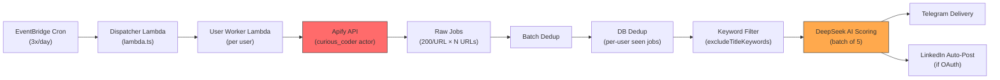
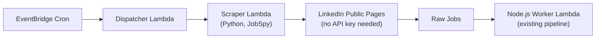
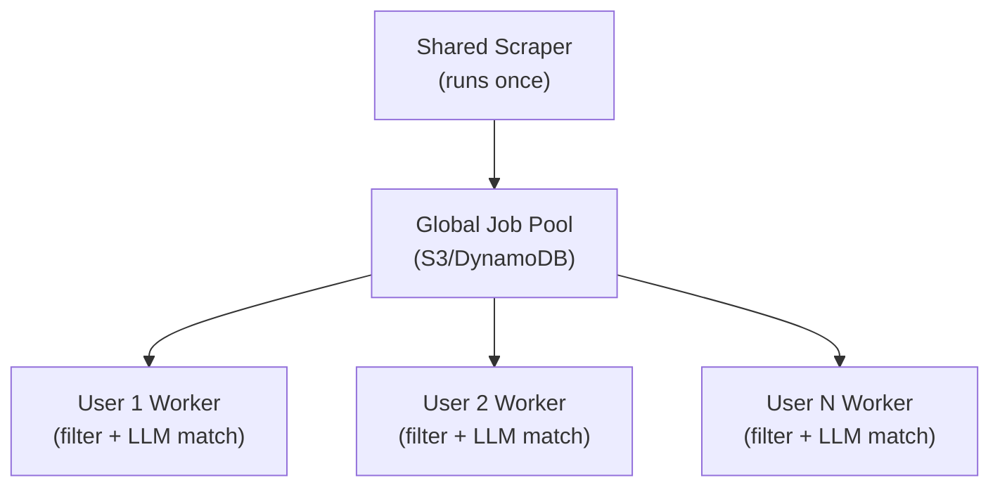

# LinkedIn Job Scraping Pipeline — Architecture Report

> **System**: apify-jobs-fetcher | **Date**: 26 Jul 2026 | **Author**: Senior Architect Review

---

## Table of Contents
1. [Current Architecture Summary](#1-current-architecture-summary)
2. [Root Cause Analysis: Why You Get Irrelevant Jobs](#2-root-cause-analysis-why-you-get-irrelevant-jobs)
3. [Cost Breakdown: Why ₹300/month Pricing is Unsustainable](#3-cost-breakdown-why-300month-pricing-is-unsustainable)
4. [The Multi-Account Rotation Problem](#4-the-multi-account-rotation-problem)
5. [Recommendation: Single URL vs Multiple URLs](#5-recommendation-single-url-vs-multiple-urls)
6. [Apify Config Audit: What's Wrong in Your Current Call](#6-apify-config-audit-whats-wrong-in-your-current-call)
7. [Alternative Approaches (Ranked)](#7-alternative-approaches-ranked)
8. [Recommended Architecture (Phase Plan)](#8-recommended-architecture-phase-plan)
9. [Cost Projection: Optimized vs Current](#9-cost-projection-optimized-vs-current)
10. [Final Verdict](#10-final-verdict)

---

## 1. Current Architecture Summary



### Current Apify Call ([apify.ts](file:///Users/manikanta/Documents/personal-projects/apify-jobs-fetcher/src/helper/apify.ts#L95-L126))

```json
{
  "urls": ["...user's linkedin search URLs..."],
  "scrapeCompany": true,
  "count": 200,           // JOBS_PER_URL
  "splitCountry": "IN",
  "useIncognitoMode": false
}
```

**Per-user flow**: 4 URLs → 200 jobs each → ~800 raw → dedup → keyword filter → DeepSeek AI → matched jobs → Telegram.

### Current Cost Per Run (per user)
| Component | Cost |
|:--|:--|
| Apify (800 jobs @ $0.001/job) | **$0.80** |
| DeepSeek LLM (scoring ~100-200 jobs) | **~$0.01-0.03** |
| **Total per run** | **~$0.83** |
| **3 runs/day** | **~$2.49/day** |
| **Monthly (30 days)** | **~$74.70/user** |

> [!CAUTION]
> You're charging ₹300/month (~$3.50/user) but spending **~$75/user/month**. That's a **21x loss**.

---

## 2. Root Cause Analysis: Why You Get Irrelevant Jobs

### Problem 1: LinkedIn's Search Algorithm is Location-Loose

When you search `backend engineer` with `splitCountry: "IN"`, LinkedIn interprets "India" broadly:
- Returns **remote jobs from US/EU** that mention "India" in description
- Returns jobs in **wrong Indian cities** (you want Bangalore/Hyderabad, it gives Jaipur/Indore)
- Returns **tangentially related roles** (e.g., "Backend Support Specialist", "Database Administrator")

**LinkedIn caps results at ~1,000 per query**. When you ask for 200 from a broad query, you get the top 200 by *LinkedIn's* relevance, which optimizes for engagement, NOT for your candidate's resume.

### Problem 2: Increasing Count Makes It Worse

Going from 200→500→1000 per URL **dilutes quality**. LinkedIn's ranking puts the most relevant results first. Jobs at position 500-1000 are scraped but almost never relevant. You're paying $1/1000 for jobs that will be rejected by your own LLM.

### Problem 3: Your Search URLs Are Too Generic

Current pattern: `backend engineer + Bangalore`, `software engineer + Hyderabad`, etc.

These broad terms match thousands of jobs. LinkedIn doesn't know your candidate wants 3-5 years experience in Node.js/Python with AWS, so it returns everything from intern to VP.

### Problem 4: `scrapeCompany: true` Is Expensive

You're paying extra compute to scrape company details for EVERY job, including the 80%+ that get rejected. Company details should only be fetched for matched jobs (or not at all — the job description itself is sufficient for matching).

---

## 3. Cost Breakdown: Why ₹300/month Pricing is Unsustainable

### Your Target Economics

| Metric | Value |
|:--|:--|
| Target price per user | ₹300/month (~$3.50) |
| Target cost per day per user | ~$0.117 |
| Runs per day | 3 |
| **Budget per run** | **$0.039** |
| Apify cost per job (pay-per-result) | $0.001 |
| **Max jobs you can afford per run** | **39 jobs** |

You're currently fetching **800 jobs/run** but can only afford **39 jobs/run**. That's a **20x overshoot**.

### The Real Math You Need

To make ₹300/month work at 3 runs/day:
- **Monthly budget**: $3.50
- **LLM costs (DeepSeek)**: ~$1.00/month (very cheap, not the problem)
- **Remaining for scraping**: $2.50/month
- **Total runs/month**: 90
- **Budget per Apify run**: **$0.028**
- **Max jobs per run at $0.001/job**: **28 jobs**

> [!IMPORTANT]
> You need to either (a) fetch **far fewer, higher-quality jobs** or (b) **eliminate the $0.001/job cost entirely**.

---

## 4. The Multi-Account Rotation Problem

Your current approach in [db_helper.ts](file:///Users/manikanta/Documents/personal-projects/apify-jobs-fetcher/src/helper/db_helper.ts#L40-L50) and [key_rotation table](file:///Users/manikanta/Documents/personal-projects/apify-jobs-fetcher/src/db/schema.ts#L73-L83):

```
- Create 5-20 Apify accounts
- Each gets $5/month free credit
- Rotate API keys when one is exhausted
- Track usage_cost < $5.00 per key
```

> [!WARNING]
> **This violates Apify's Terms of Service.** Apify explicitly prohibits creating multiple accounts to circumvent free tier limits. They monitor for this and can:
> - Delete all your accounts simultaneously
> - Blacklist your IP/payment methods
> - Pursue legal action for ToS violation
>
> This is a **ticking time bomb**. One day all your keys stop working and your entire product goes down.

**Risk Assessment**: HIGH. This is not a sustainable business foundation.

---

## 5. Recommendation: Single URL vs Multiple URLs

### The Answer: **Multiple Narrow URLs, Fewer Results Each**

Here's why and how:

| Strategy | Relevance | Cost | Recommendation |
|:--|:--|:--|:--|
| 1 URL + "India" + 1000 results | ❌ Very Low | 💰 $1.00 | **Never do this** |
| 1 URL + "India" + 200 results | ❌ Low | 💰 $0.20 | Still too broad |
| 4 URLs × city-specific + 200 each | ⚠️ Medium | 💰 $0.80 | Current approach, too expensive |
| **4 URLs × city-specific + 25 each** | ✅ High | 💰 $0.10 | **Sweet spot** |
| **6-8 narrow URLs × 15 each** | ✅ Highest | 💰 $0.10-0.12 | **Best relevance/cost ratio** |

### Why Narrow + Low Count Wins

LinkedIn returns results **ranked by relevance**. The top 15-25 results for a well-crafted query are significantly more relevant than results 100-200. By using:

- **More specific keywords**: `"Node.js backend engineer"` instead of `"backend engineer"`
- **City-level geoIds**: `geoId=90009633` (Bengaluru) instead of `splitCountry: IN`
- **Low count per URL**: 15-25 results, taking only the cream

You get **fewer, better jobs** and spend less money.

### Recommended URL Strategy Per User

Instead of manually crafting URLs, **auto-generate them from the user profile**:

```
User Profile:
  suggestedJobTitles: ["Backend Engineer", "Node.js Developer", "Software Engineer"]
  targetLocations: "Bangalore, Hyderabad"

Auto-Generated URLs (6 total):
  1. "Backend Engineer" + geoId=90009633 (Bengaluru)  → 15 results
  2. "Backend Engineer" + geoId=105556991 (Hyderabad) → 15 results
  3. "Node.js Developer" + geoId=90009633             → 15 results
  4. "Node.js Developer" + geoId=105556991            → 15 results
  5. "Software Engineer" + geoId=90009633              → 15 results
  6. "Software Engineer" + geoId=105556991             → 15 results
  
  Total: ~90 jobs (many will dedup) → ~50-60 unique → keyword filter → ~30-40 → LLM → 5-15 matched
  Cost: $0.09 per run
```

> [!TIP]
> You already have `suggestedJobTitles` and `targetLocations` in your [users table](file:///Users/manikanta/Documents/personal-projects/apify-jobs-fetcher/src/db/schema.ts#L23-L24). Use them to **auto-generate search URLs** instead of requiring manual admin effort.

---

## 6. Apify Config Audit: What's Wrong in Your Current Call

### Current Config Issues

```javascript
// apify.ts line 99-105
const body = JSON.stringify({
  urls,
  scrapeCompany: true,      // ❌ WASTEFUL — costs extra compute for jobs you'll reject
  count: 200,               // ❌ TOO HIGH — top 25 are most relevant
  splitCountry: "IN",       // ⚠️ TOO BROAD — use geoId in URLs instead
  useIncognitoMode: false   // ✅ CORRECT — incognito can trigger more anti-bot
});
```

### Recommended Config

```javascript
const body = JSON.stringify({
  urls,                       // Pre-built with city-level geoIds
  scrapeCompany: false,       // ✅ Don't waste compute on company scraping
  count: 20,                  // ✅ Only top 20 per URL (high relevance zone)
  // Remove splitCountry — handle location via geoId in URLs
  useIncognitoMode: false     // ✅ Keep as-is
});
```

### URL Construction Best Practices

Use LinkedIn's native URL parameters for precision:

| Parameter | Purpose | Recommended Value |
|:--|:--|:--|
| `keywords` | Job title | From `suggestedJobTitles` |
| `geoId` | City-level location | See table below |
| `f_TPR` | Time posted | `r43200` (12h) — your lookback window |
| `f_E` | Experience level | `3,4` (Associate + Mid-Senior) |
| `f_JT` | Job type | `F` (Full-time) |
| `sortBy` | Sort order | `DD` (Date, newest first) |

### India City geoIds

| City | geoId |
|:--|:--|
| Bengaluru (Greater) | `90009633` |
| Hyderabad (Greater) | `90009650` |
| Mumbai Metro | `90009639` |
| Delhi/NCR | `106187582` |
| Gurugram | `115884833` |
| Noida | `104869687` |
| Pune | `114806696` |
| Chennai | `106888327` |

### Example Optimized URL

```
https://www.linkedin.com/jobs/search/?keywords=Backend%20Engineer&geoId=90009633&f_TPR=r43200&f_E=3%2C4&f_JT=F&sortBy=DD
```
This searches for "Backend Engineer" in Bengaluru, posted in last 12h, Associate/Mid-Senior level, Full-time, sorted by newest.

---

## 7. Alternative Approaches (Ranked)

### Option A: Optimized Apify (Quick Win — Recommended for Now)

**What**: Keep Apify but drastically reduce waste.

| Change | Impact |
|:--|:--|
| Reduce `count` from 200 → 20 | 10x cost reduction |
| Auto-generate narrow URLs from user profile | 3-5x relevance improvement |
| Set `scrapeCompany: false` | Faster runs, lower compute |
| Use city-level geoIds instead of `splitCountry` | Much better location accuracy |
| Add `f_E`, `f_JT`, `sortBy=DD` to URLs | Filter at source, not in code |

**Cost**: ~$0.06-0.10/run → ~$0.18-0.30/day → **~$5.40-9.00/month per user**

**Still over budget** but much closer. Combine with reducing to 2 runs/day → **~$3.60-6.00/month**.

---

### Option B: python-jobspy (Self-Hosted, Free — Best Long-Term)

**What**: Replace Apify entirely with the open-source [python-jobspy](https://github.com/Bunsly/JobSpy) library running on your own infrastructure.

```python
from jobspy import scrape_jobs

jobs = scrape_jobs(
    site_name=["linkedin"],
    search_term="Backend Engineer",
    location="Bengaluru, India",
    results_wanted=25,
    hours_old=12,
    country_indeed="India"
)
```

**Architecture change**:


| Pros | Cons |
|:--|:--|
| **$0 scraping cost** — library is MIT-licensed | Needs residential proxies (~$5-15/month shared) |
| Scrapes public LinkedIn guest pages (no login) | Can break when LinkedIn updates HTML |
| Supports multiple sources (Indeed, Glassdoor too) | Needs Python Lambda or ECS task |
| Full control over query parameters | More maintenance responsibility |

**Cost**: Proxy cost only → **~$5-15/month total** (shared across ALL users, not per user).

**Risk**: Medium. LinkedIn can block IPs, but with residential proxies and rate limiting, community reports stable usage for months.

> [!TIP]
> **This is how most indie hackers and small SaaS products do it.** Reddit and HackerNews are full of people running JobSpy or similar libraries with $10/month residential proxies serving hundreds of users.

---

### Option C: Hybrid — JobSpy Primary, Apify Fallback

**What**: Use JobSpy for 90% of scrapes. Fall back to Apify (single legitimate paid account) only when JobSpy gets blocked.

**Cost**: ~$5/month proxy + $0 JobSpy + ~$5/month Apify Starter (for fallback) = **~$10/month total**.

This is the most resilient option.

---

### Option D: LinkedIn RSS + Google Jobs API (Ultra Low-Cost)

**What**: Instead of scraping LinkedIn directly:
1. Use **Google Jobs API** (via SerpAPI or similar) — searches LinkedIn listings indexed by Google
2. Use **LinkedIn RSS feeds** for saved searches (limited but free)

**Cost**: SerpAPI free tier gives 100 searches/month. Enough for ~3 users.

**Risk**: Lower data freshness, fewer results. Only viable for very small scale.

---

### Option E: Manual Browser Automation (Playwright on Lambda/ECS)

**What**: Run headless Chromium via Playwright, navigate LinkedIn public job search, extract results.

**Cost**: Just compute (~$0.01/run on Lambda).

**Risk**: HIGH maintenance. LinkedIn's anti-bot is aggressive. You'll spend more time fixing selectors than building features. **Not recommended** unless you have dedicated DevOps time.

---

## 8. Recommended Architecture (Phase Plan)

### Phase 1: Immediate (This Week) — Optimize Apify Config

**Zero code changes to pipeline. Just config.**

1. **Reduce `JOBS_PER_URL` from 200 to 20** in [apify.ts](file:///Users/manikanta/Documents/personal-projects/apify-jobs-fetcher/src/helper/apify.ts#L14)
2. **Set `scrapeCompany: false`** in [apify.ts line 101](file:///Users/manikanta/Documents/personal-projects/apify-jobs-fetcher/src/helper/apify.ts#L101)
3. **Auto-generate URLs** from `suggestedJobTitles` × `targetLocations` with proper geoIds, `f_E`, `f_JT`, `sortBy=DD` in [filter.ts](file:///Users/manikanta/Documents/personal-projects/apify-jobs-fetcher/src/helper/filter.ts)
4. **Reduce runs from 3x/day to 2x/day** (morning + evening)
5. **Remove `splitCountry`** — use geoId in URLs instead

**Expected cost**: ~$0.06/run × 2 runs/day × 30 days = **~$3.60/user/month** ✅

### Phase 2: Short-Term (Next 2 Weeks) — Add JobSpy Layer

1. Add a **Python Lambda or ECS Fargate task** running `python-jobspy`
2. Purchase **one shared residential proxy** (~$10/month, covers all users)
3. JobSpy scrapes → dumps results to S3 → existing Node.js worker picks up
4. Keep Apify as fallback (single legitimate paid account, $9/month Starter)

**Expected cost**: ~$10 proxy + $9 Apify fallback = **$19/month total for ALL users**

With 10 users: **$1.90/user/month** ✅✅

### Phase 3: Medium-Term — Shared Job Pool

The biggest cost optimization: **stop scraping the same jobs for every user**.

Right now, if 5 users all want "Backend Engineer in Bangalore", you scrape LinkedIn 5 times. Instead:



1. **Scrape once per unique search query** (not per user)
2. Store in a **shared job pool** with TTL
3. Each user worker reads from the pool and applies their personal filters + LLM scoring

If 10 users share 80% of the same search queries, you cut scraping costs by **~80%**.

---

## 9. Cost Projection: Optimized vs Current

### Per User Per Month (assuming 2 runs/day)

| Component | Current | Phase 1 | Phase 2 | Phase 3 (10 users) |
|:--|:--|:--|:--|:--|
| Apify Scraping | $74.70 | $3.60 | $0.90 (fallback) | $0.19 |
| Proxy | $0 | $0 | $1.00 (shared) | $1.00 |
| DeepSeek LLM | $1.00 | $0.50 | $0.50 | $0.50 |
| AWS Lambda | ~$0.50 | ~$0.50 | ~$0.70 | ~$0.70 |
| **Total/user/month** | **~$76.20** | **~$4.60** | **~$3.10** | **~$2.39** |
| Fits ₹300 budget? | ❌ | ⚠️ Tight | ✅ | ✅✅ |

---

## 10. Final Verdict

### Direct Answers to Your Questions

| Question | Answer |
|:--|:--|
| Single URL with India, or multiple URLs with cities? | **Multiple URLs with city-level geoIds** — dramatically better relevance |
| How many results per URL? | **15-25 max** — LinkedIn's top results are the most relevant |
| Call Apify 4 times or once with all URLs? | **Once with all URLs** — your current batching approach is correct, just reduce `count` |
| Is Apify a good solution long-term? | **No for your price point.** It's $0.001/job and you can't afford 800 jobs/run. Use it short-term, migrate to JobSpy. |
| Should you do manual scraping? | **Yes, via python-jobspy** — it's the industry standard for indie/startup scale. Not raw Playwright. |
| Is `scrapeCompany: true` needed? | **No.** Job description text is sufficient for LLM matching. Remove it. |
| Is `useIncognitoMode: false` correct? | **Yes.** Incognito triggers more anti-bot checks. |
| Is the multi-account rotation safe? | **No. It violates Apify ToS.** Migrate to a single paid account + JobSpy. |

### The One-Line Strategy

> **Fetch fewer, better jobs (20/URL with geoIds + experience filters) now. Migrate to self-hosted JobSpy within 2 weeks. Build a shared job pool when you hit 10+ users.**

> [!IMPORTANT]
> The single biggest win is reducing `JOBS_PER_URL` from 200 to 20 and using city-level geoIds. This alone cuts your cost by ~10x and improves relevance. You can do this today with a 2-line code change.
